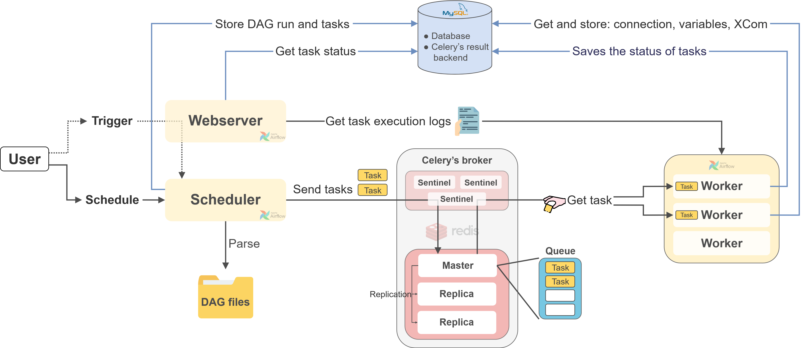

# Airflow Production Cluster Setup

This repository demonstrates how to build and configure an Apache Airflow 2.10 environment using CeleryExecutor. Redis Sentinel is used as the queue broker, while MySQL serves as the metadata database backend. The project focuses on a practical and reproducible setup that is suitable for production environments. Redis Sentinel can be deployed on Node 1 through Node 3, as demonstrated in this project, or on three dedicated hosts.

---

## Architecture

| Component \ Server IP  | Node 1 | Node 2 | Node 3 | Node 4 |
| --- |:---:|:---:|:---:|:---:|
| Scheduler        |  O  |  O  |  -  |  -  |
| Webserver        |  O  |  O  |  -  |  -  |
| Worker           |  O  |  O  |  O  |  -  |
| Flower           |  O  |  -  |  -  |  -  |
| MySQL            |  -  |  -  |  -  |  O  |
| Redis            |  O  |  O  |  O  |  -  |
| Redis Sentinel   |  O  |  O  |  O  |  -  |
| Redisinsight     |  -  |  -  |  -  |  O  |

## Environment

- VM * 4
- OS: Ubuntu Server 22.04 LTS
- Docker Compose: `v2.26.1`
- Python: 3.10.12
- Airflow: 2.10.5
- Redis: 7.2.4
- MySQL image tag: `oraclelinux8`
